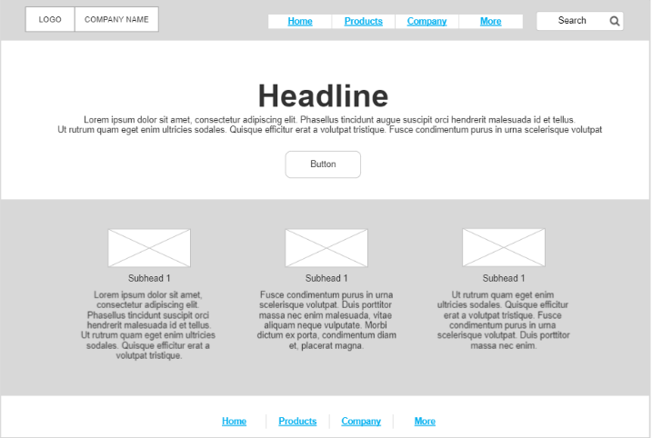
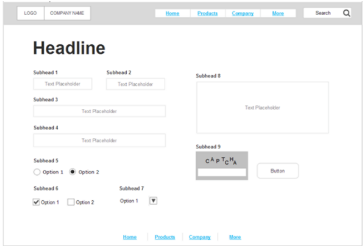
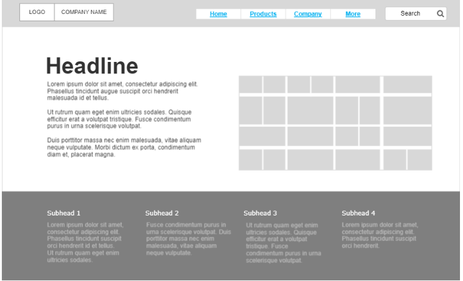
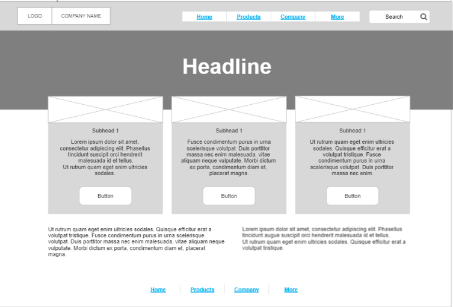

# wireframe2website

# Task-2

# webSite structure

---
 In this project we used a tool
 1-vs code
 =======
---

---
=======
# css-task-3

# styling with css 

# add 3 html page 
---
 In this project we used a tool
 1-vs code
 2-css 
 2-html 
 =======
